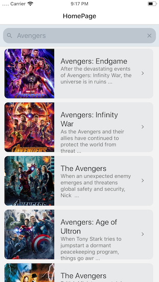
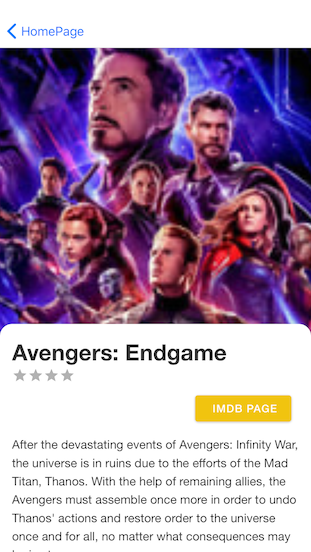
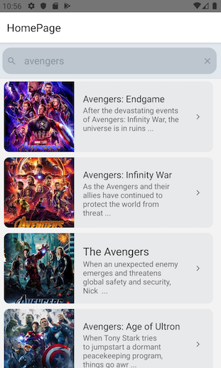
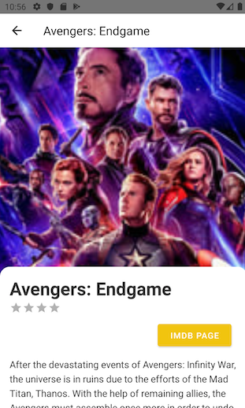

# MovieApp

**run**

`yarn install`

**for iOS - to link missing dependencies**

`cd ios` 
`pod install` 
`cd ..` 

**run (optional)** 
`react-native link react-native-reanimated` 
`react-native link react-native-gesture-handler` 
`react-native link react-native-screens` 
`react-native link react-native-vector-icons`  

  

**for Android** 
in case you run into `keystore debug` issue, follow instructions at (keystore debug )(https://github.com/facebook/react-native/issues/25629)  
in `android/app/` directory  
run :  
`keytool -genkey -v -keystore debug.keystore -storepass android -alias androiddebugkey -keypass android -keyalg RSA -keysize 2048 -validity 10000`

### iOS

  

### Android

