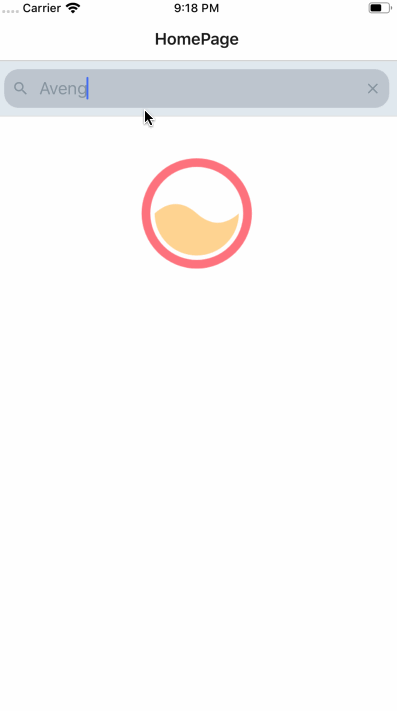
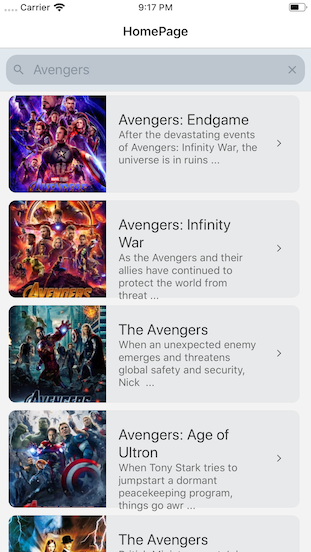
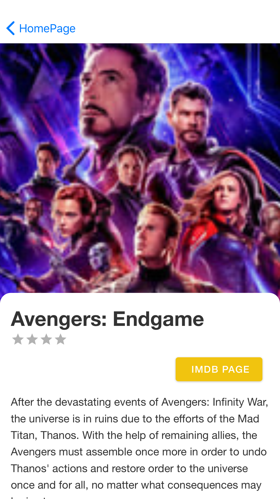

# MovieApp

**for iOS - to link missing dependencies**

`yarn install`

**for iOS - to link missing dependencies**

`react-native link react-native-reanimated` 
`react-native link react-native-gesture-handler` 
`react-native link react-native-screens` 
`react-native link react-native-vector-icons` 

`cd ios` 
`pod install` 
`cd ..`

  

